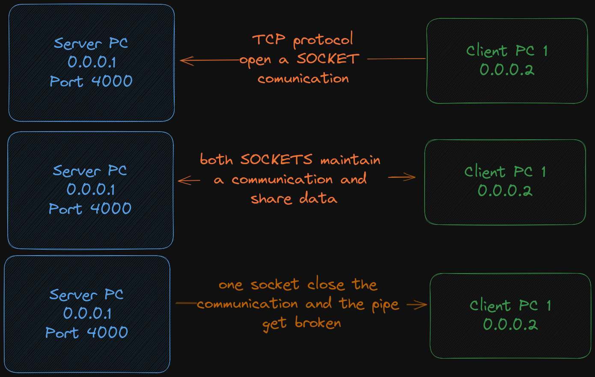

# Sockets Server
In this project I had to learned how sockets work, this is a simple server/client app where you can start the server and connect 2 or more clients and talk with a simple cli interface. I will leave some links to learn more about sockets and a simple diagram [IBM](https://www.ibm.com/docs/en/i/7.2?topic=programming-how-sockets-work), [Oracle](https://docs.oracle.com/javase/tutorial/networking/sockets/definition.html).

